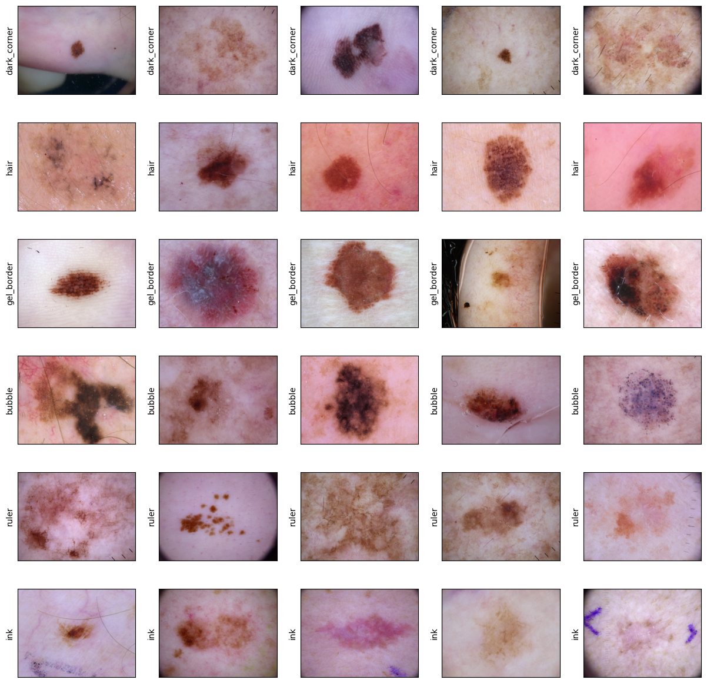

# Debiasing Skin Cancer Detection

## Table of Content
* [Annotation](#Annotation)
    * [Data](#Data)
    * [Annotation Webpage](#AnnotationWebpage)
* [Analysis](#Analysis)
* [References](#References)

## Annotation  <a name="Annotation"></a>

### Data  <a name="Data"></a>

You can download the link for zipped combine dataset using [Drive Link](https://drive.google.com/file/d/11hP_2PjwkzgUbaOyXHn7EEWDURJZPqpv/view?usp=sharing)

The data folder should be containing the HAM10000_metadata.csv and the two folders containing the images that is unzipped from the link [Dataverse](https://dataverse.harvard.edu/dataset.xhtml?persistentId=doi:10.7910/DVN/DBW86T). Make sure to download both the **HAM10000_images_part_1/** and **HAM10000_images_part_2/** folder.  

Combine the imgs into one folder and called imgs under data.  

### Annotation Webpage <a name="AnnotationWebpage"></a>
I created a webpage for easier annotation using flask.

To start the flask app 
```
python3 app.py
```
This will open up on the browser http://127.0.0.1:5000/

### Samples 
I have plotted some samples from the each of the metadata in the jupyter notebook [Analysis.ipynb](Analysis.ipynb)   
There are 6 categories that we annotated : 
* Dark Corner
* Hair
* Gel Border
* Bubble
* Ruler
* Ink

  

## Analysis <a name="Analysis"></a>

### ToDo
- [ ] Correlation between metadata and class (categorical correlation)
- [ ] Creating biased dataset between the class and the categorical feature
- [ ] Train a simple model to demonstrate how bias can lead to poor performance through the test dataset

## References <a name="References"></a>
* [HAM1000 Paper](https://www.nature.com/articles/sdata2018161)
* [Previous Metadata Annotation Paper](https://openaccess.thecvf.com/content_CVPRW_2020/papers/w42/Bissoto_Debiasing_Skin_Lesion_Datasets_and_Models_Not_So_Fast_CVPRW_2020_paper.pdf)
* [Github Repo](https://github.com/alceubissoto/debiasing-skin)